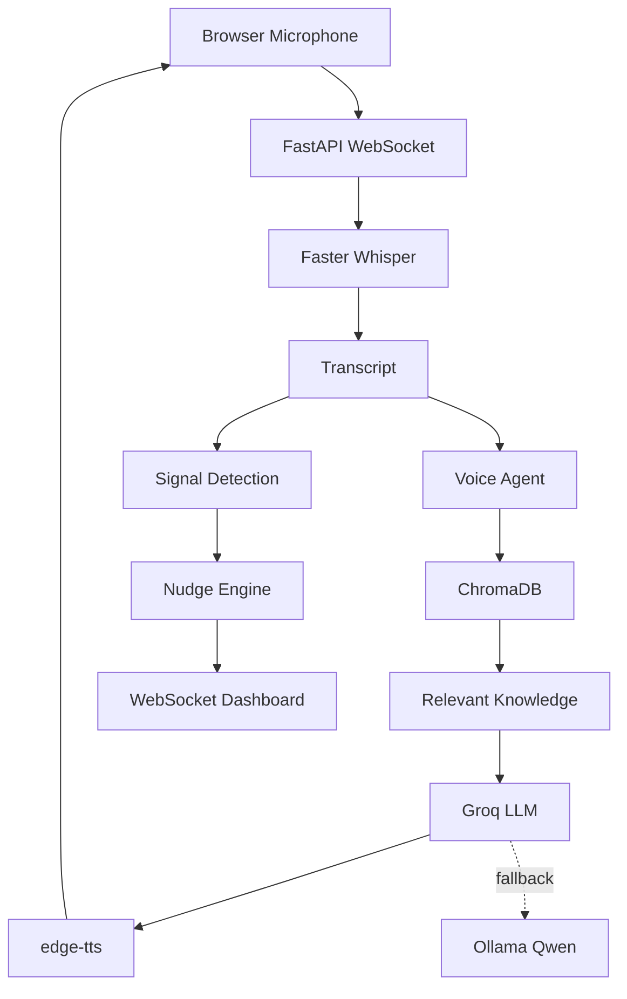

# AI Engineer Assessment — Master Execution Plan & Project Handoff

**Purpose:** This is the single source-of-truth handoff document for the AI Engineer Assessment. It consolidates the assessment requirements, all useful decisions from the planning discussions, the final architecture/stack, implementation order, deliverables, test requirements, completed work, unresolved items, risks, and next actions.

**Source basis:** `AI_Engineer_Assessment.pdf` plus the planning/context document `Pasted markdown(1).md`.  
**Important status rule:** Items marked **COMPLETED / VERIFIED** are only things explicitly confirmed in the supplied context. Planned code/features are **NOT** marked complete unless the context explicitly says they were built/tested.

---

# 1. Assessment at a Glance

## Hard constraints

- Submission deadline: **within 48 hours** of receiving the assessment.
- All **four questions** must have working outcomes.
- **Q1 and Q2 are connected:** the voice agent must use the knowledge base built for Q2.
- Q1/Q3 recorded calls may be reused for Q4.
- Prioritize a reliable core workflow over visual polish.
- A generic architecture/PRD without a working prototype is a rejection risk.
- Hallucinated answers, a disconnected KB and voice bot, unmeasured latency, literal multilingual translation, post-call-only nudges, and excessive low-value alerts are explicit rejection risks.

The assessment weights:
- Business problem understanding — **15%**
- Research/domain understanding — **10%**
- End-to-end completeness — **15%**
- Output quality — **20%**
- Functional implementation — **15%**
- AI-tool usage and independent thinking — **10%**
- Feasibility, edge cases, technical depth — **10%**
- Presentation and communication — **5%**

**Strategic implication:** end-to-end functionality matters much more than visual polish.

---

# 2. What the Four Questions Require

## Q1 — Knowledge-Grounded Voice Agent

Choose one:
- Health-insurance lead qualification
- Business-loan qualification
- Candidate screening
- Insurance renewal
- Loan pre-due reminder

Required:
- Configure voice platform/interface and add script/business rules.
- Connect Q2 KB; do NOT hardcode all FAQs, objections, and policies in the system prompt.
- Conversation flow.
- Qualification logic.
- Grounded objection handling.
- Unsupported-question fallback.
- Human escalation.
- Callable number OR web calling interface.
- At least 3 test calls with transcripts/results.

Required scenarios:
1. Cooperative customer
2. Objection
3. Incomplete/conflicting details
4. Out-of-scope question
5. Human-assistance request

The bot must explicitly say when information is unavailable rather than inventing an answer.

Optional business action:
- Lead creation
- Callback scheduling
- Preliminary eligibility
- Quotation request
- Mock CRM summary
- Escalation webhook

**Chosen implementation direction:** Business-loan qualification, using a deterministic state machine plus LLM for natural language/objections/FAQ.

---

## Q2 — Production-Ready Knowledge Base

Must handle mixed business material:
- Web pages
- Product/marketing content
- Policy/qualification rules
- Forms
- Tables
- PDFs
- Duplicate material
- Inconsistent terminology
- PII

Pipeline must cover:
- Extraction/parsing
- Navigation/header/footer/irrelevant-content removal
- Extraction failure handling
- Obvious source-error flagging
- Exact and near-duplicate removal
- Standardized headings/dates/terminology/categories/form fields
- PII identification/protection
- Schema
- Chunking
- Metadata
- Product/policy taxonomy
- Source tracking
- Versioning
- Embedding/indexing
- Retrieval/ranking
- Citations

Retrieval evaluation:
- At least **5 queries**
- For each: question, retrieved chunk/record, source reference, relevance explanation, verdict
- Verdict: correct / partially correct / incorrect
- Demonstrate product, policy, qualification, FAQ, and objection questions
- Connect to Q1 or provide a retrieval interface

---

## Q3 — Native-Language Voice Bots

Two localized prototypes.

### Philippines
Sector:
- Life insurance OR bancassurance

Must support:
- English
- Filipino/Tagalog
- Natural Taglish

Natural terminology examples:
- premium
- policy
- beneficiary
- rider
- lapse
- coverage
- bank referral

### Indonesia
Sector:
- Multifinance OR consumer finance

Must support:
- Formal Bahasa Indonesia
- Colloquial Bahasa Indonesia
- Finance-related English loanwords
- At least one regional accent outside standard Jakarta speech

Natural terminology examples:
- cicilan
- tenor
- denda
- DP
- jatuh tempo
- angsuran
- pembiayaan

Shared requirements:
- Configure/test ASR separately per market.
- Report provider/model, languages, code-switching behavior, approximate quality, observed errors, and Indonesian regional-accent performance.
- Localize scripts, FAQs, objections, rules, politeness, dates, amounts, and payment explanations.
- At least **3 localization/adaptation examples per market**; not direct translations.
- Native TTS where possible; document compromises.
- Fallback/escalation must remain in the customer's language/register.

Required coverage:
- Cooperative customer
- Sector-specific objection
- Mixed English/finance terms
- Colloquial speech
- Human escalation
- Indonesian regional accent

Evidence:
- **2 recorded calls per market = 4 minimum**
- Transcripts
- Configurations
- Terminology
- Localization examples
- Code-switching behavior
- Accent observations
- Comparison
- Known native-speaker/compliance gaps

---

## Q4 — Live Insights and Real-Time Nudges

The system must analyze a call **while it is happening**. Post-call-only recording analysis does not qualify.

Streaming input may be:
- Live call audio, OR
- Recording replayed at real-time speed in chunks

Pipeline:
1. Audio streaming
2. Continuous/chunked ASR
3. Transcript with agent/customer separation where possible
4. Signal extraction
5. Nudge generation
6. Dashboard/WebSocket/API/CLI delivery

Track:
- Intent/topic shifts
- Compliance/risk
- Sentiment/frustration
- Buying signals
- Missed opportunities
- Callback needs

Latency:
- audio received → transcription → signal detection → nudge generation → display
- Report **P50/P95**
- Report component latency for ASR, signal extraction, LLM, delivery

Nudge controls:
- Confidence threshold
- Duplicate suppression
- Cooldown
- Topic grouping
- Priorities
- Expiry/repetition rules

Quality:
- Approximate false-positive analysis

Required test coverage:
- Missed cross-sell
- Skipped disclosure/risky statement
- Rising frustration
- Noisy/ambiguous call where unnecessary nudges should be avoided

Must provide:
- At least one compliance example
- At least one missed-opportunity example
- Limitations at 10x scale and with noisy audio
- Recorded live demo

---

# 3. Final Architecture Decision

Build **ONE integrated local-first AI system**, not four disconnected prototypes.

```text
                         ┌─────────────────────────────┐
                         │         Web Browser          │
                         │                             │
                         │  Q1 Voice Interface         │
                         │  Q2 Retrieval UI            │
                         │  Q3 Multilingual UI         │
                         │  Q4 Live Nudge Dashboard   │
                         └──────────────┬──────────────┘
                                        │
                                  HTTP / WebSocket
                                        │
                         ┌──────────────▼──────────────┐
                         │       FastAPI Backend        │
                         │                              │
                         │ Voice Agent | RAG | Realtime│
                         │ State       | KB  | Nudges   │
                         └───────┬──────────────┬───────┘
                                 │              │
                    ┌────────────▼──────┐ ┌────▼─────────────┐
                    │ Local Knowledge   │ │ Local/Free AI   │
                    │ Base              │ │ Models/APIs      │
                    │                   │ │                 │
                    │ ChromaDB          │ │ faster-whisper  │
                    │ Metadata/Citations│ │ edge-tts        │
                    └───────────────────┘ │ Ollama fallback │
                                          │ Groq primary    │
                                          └─────────────────┘
```

Mermaid version for README:



---

# 4. Final Zero-Cost/Local-First Tech Stack

## Primary stack

| Layer | Final choice | Purpose |
|---|---|---|
| Backend | Python 3.11 | Single language across core system |
| API | FastAPI | HTTP + WebSocket backend |
| Server | Uvicorn | ASGI server |
| Realtime | WebSockets + asyncio | Audio/transcript/nudge streaming |
| LLM primary | Groq API, currently verified model `openai/gpt-oss-20b` | Fast conversational/NLU/classification path |
| LLM fallback | Ollama + `qwen2.5:3b` | Local zero-cost backup |
| ASR | faster-whisper | Local speech-to-text |
| TTS | edge-tts | English + Filipino + Indonesian voices |
| Embeddings | sentence-transformers | Local embeddings |
| Embedding model | `all-MiniLM-L6-v2` for English; multilingual variant if needed for Q3 | Vector retrieval |
| Vector DB | ChromaDB persistent local client | Local RAG store |
| PDF parsing | pypdf | PDF extraction |
| DOCX parsing | python-docx | DOCX extraction |
| HTML parsing | BeautifulSoup4 + lxml | Web extraction |
| Tabular data | pandas | CSV/table handling |
| PII | Regex first; Presidio if time permits | PII detection |
| Frontend | Plain HTML/CSS/vanilla JS | Fastest functional UI |
| Recording | OBS Studio | Demo/call recording |
| Architecture | Mermaid in README | Diagram without extra tooling |
| Repository | GitHub | Submission |
| Hosting | Localhost | Zero external hosting cost |

### Deliberately removed from the final plan

Do NOT add:
- Vapi
- Twilio
- Retell
- Bland
- ElevenLabs
- OpenAI API
- Pinecone
- Supabase
- AWS/Azure/GCP
- Paid cloud GPUs
- Next.js/React/Tailwind for this 48-hour scope
- Complex authentication
- User accounts
- Kubernetes
- Docker unless unexpectedly necessary
- LangChain
- LangGraph
- A full agent framework
- Mobile app
- Fancy animations
- Production deployment

The browser itself is the "phone" through microphone/WebSocket.

---

# 5. Why the Final Stack Changed From Earlier Plans

Earlier plans considered:
- Vapi / LiveKit / ElevenLabs
- Gemini/Groq
- Ollama as primary LLM
- Piper TTS
- Next.js/React/Tailwind
- Streamlit

The final plan improves them as follows:

### 5.1 No paid voice platform
The assessment explicitly accepts a web calling interface. Therefore browser microphone + WebSocket removes telephony/platform costs.

### 5.2 Groq primary, Ollama fallback
The earlier fully-local plan risked slow CPU conversational latency. The current verified Groq setup gives a measured **0.47s LLM latency**, so it is the primary conversational path. Ollama remains the local fallback.

### 5.3 edge-tts primary instead of Piper
The exact Filipino/Indonesian voices required for Q3 were uncertain with Piper. edge-tts voices were explicitly verified in the planning context.

### 5.4 Plain HTML/JS instead of Next.js
The assessment rewards functional implementation much more than visual polish. A framework would consume time without improving the core score.

### 5.5 No ngrok
Once the project uses browser/local FastAPI rather than Vapi callbacks, ngrok is unnecessary for local development.

### 5.6 Keep Q1 deterministic
The LLM should NOT own the whole conversation. Python owns state, required fields, escalation, and termination. The LLM handles natural language, objections, and FAQ generation.

### 5.7 Reuse Q1 for Q3
Use a `MarketConfig` pattern instead of cloning the agent.

### 5.8 Structured Q4 nudges
Use structured JSON:
```json
{
  "signal": "rising_frustration",
  "confidence": 0.87,
  "evidence": "Customer repeated the complaint twice.",
  "nudge": "Acknowledge the customer's concern before continuing."
}
```

### 5.9 Concrete false-positive testing
Run approximately 20 situations:
- 10 where a nudge SHOULD appear
- 10 where it SHOULD NOT

Measure TP/FP/TN/FN and:
```text
FPR = FP / (FP + TN)
```

---

# 6. Q1 Detailed Design

## Chosen use case
**Business-loan qualification**

Recommended qualification sequence:

```text
START
  ↓
INTRODUCTION
  ↓
CONSENT
  ↓
BUSINESS_DETAILS
  ↓
REVENUE
  ↓
LOAN_REQUIREMENT
  ↓
QUALIFICATION
  ↓
OBJECTION_HANDLING
  ↓
SUMMARY
  ↓
ESCALATE / END
```

Fields:
- Name
- Business type
- Years operating
- Monthly revenue
- Loan amount
- Loan purpose
- Existing loans
- Qualification result
- Callback/human assistance

### Division of responsibility

Python/state machine:
- Qualification state
- Required fields
- State transitions
- Escalation
- Termination
- Business action

LLM:
- Natural-language understanding
- Objection handling
- FAQ response composition
- Conversational wording

RAG:
- All factual policy/product/FAQ/objection knowledge

### Grounded answer flow

```text
Customer question
      ↓
Q2 /search
      ↓
Top chunks + similarity
      ↓
Threshold check
   /           \
YES             NO
 ↓               ↓
LLM answer     Safe fallback
 ↓
Source IDs
```

Fallback:
> "I don't have that information on hand, but I can log this and connect you with a representative."

Never invent:
- Policies
- Prices
- Eligibility
- Interest rates
- Commitments

### Objection flow

```text
Customer objection
      ↓
Retrieve objection-related KB chunks
      ↓
LLM
      ↓
Grounded response
```

If no reliable KB result:
- State that reliable information is unavailable.
- Offer human assistance.
- Do not improvise assurances.

### Human escalation

Create an `escalation.json` equivalent containing:
```json
{
  "reason": "human_requested",
  "customer_summary": "...",
  "qualification_status": "incomplete",
  "timestamp": "..."
}
```

### Q1 test calls

Minimum = 3; planned = **5**:

1. Cooperative customer
2. Customer objection
3. Incomplete/conflicting information
4. Out-of-scope question
5. Human assistance request

For each:
- `call_XX.wav`
- `call_XX.txt`
- `call_XX.json`

---

# 7. Q2 Detailed Design

Q2 is the first actual implementation feature because Q1 depends on it.

## Ingestion pipeline

```text
Web/PDF/DOCX/CSV/TXT
        ↓
Parser
        ↓
Cleaner
        ↓
PII detection
        ↓
Deduplication
        ↓
Normalization
        ↓
Chunker
        ↓
Embedding
        ↓
ChromaDB
        ↓
FastAPI /search
```

### Parsers

- PDF → `pypdf`
- DOCX → `python-docx`
- HTML → `BeautifulSoup4` + `lxml`
- CSV → `pandas`
- TXT → Python

### Cleaning

Remove:
- Navigation
- Headers
- Footers
- Sidebars
- Repeated sections
- Irrelevant boilerplate

Handle:
- Extraction failures
- Obvious source errors
- Duplicate/near-duplicate content
- Inconsistent terminology
- Dates/numbers/headings normalization

### PII

Preferred:
- Regex for obvious patterns
- `presidio-analyzer` / anonymizer if time allows

If Presidio setup becomes a time sink:
- Use robust regex for the assessment prototype
- Document the limitation

### Deduplication

Use:
- Hashing for exact duplicates
- MinHash/near-duplicate approach if practical

### Chunking

Initial planned values:
- Recursive character splitting
- `chunk_size=400`
- `chunk_overlap=50`

### Record schema

```json
{
  "record_id": "kb_001",
  "title": "Personal Loan Eligibility",
  "content": "...",
  "category": "qualification",
  "source": "loan_policy.pdf",
  "source_page": 4,
  "version": "1.0",
  "contains_pii": false
}
```

Required metadata:
- `record_id`
- `title`
- `content`
- `category`
- `source`
- `source_page` where available
- `version`
- `contains_pii`

### Retrieval

Initial target:
- top 3–5 chunks
- similarity score
- threshold
- explicit source/citation tags

API:
```text
POST /knowledge/search
```

Example request:
```json
{
  "query": "What are the loan eligibility requirements?"
}
```

Example response:
```json
{
  "answer": "...",
  "sources": [
    {
      "record_id": "kb_023",
      "source": "policy.pdf",
      "page": 4
    }
  ]
}
```

### Required retrieval evaluation

At least 5 tests covering:
1. Product
2. Policy
3. Qualification
4. FAQ
5. Objection
6. Unsupported question is also strongly recommended

Record:
- User question
- Retrieved chunk/record
- Source
- Relevance explanation
- Verdict

---

# 8. Source Material Decision

## What the assessment provides

The uploaded assessment PDF provides the requirements but **does not provide the actual business script, FAQs, policy documents, product information, forms, or other business source material needed for Q1/Q2**.

Therefore, do not pretend those materials were supplied.

## Source options considered

### Real public sources
Possible categories:
- Philippine insurance/lending company public pages
- Indonesian multifinance public pages
- Government/regulatory material
- Public product pages, FAQs, brochures and PDFs

Examples mentioned during planning:
- Sun Life Philippines
- BPI-Philam
- Pag-IBIG Fund
- Adira Finance
- FIFGROUP
- Philippines Insurance Commission
- BSP
- Indonesia OJK
- SBA/general public lending sources

### Synthetic source material

Recommended for this 48-hour assessment:
**Create 15–20 realistic, deliberately messy synthetic documents.**

Why:
- Full control over facts
- No scraping failure risk
- Can intentionally include duplicates
- Can intentionally include inconsistent terminology
- Can include PII examples to test masking
- Can cover all required product/policy/qualification/FAQ/objection questions
- Faster than debugging arbitrary websites

Important: label these as **synthetic/mock business materials** in the submission rather than pretending they are real company documents.

---

# 9. Q3 Detailed Design

Reuse the Q1 agent core.

```text
                 Qualification Agent
                 /       |        \
           English    Filipino    Indonesian
                         |
                       Taglish
```

Use a `MarketConfig` abstraction.

### PhilippinesConfig
Contains:
- Language rules
- Terminology
- Objections
- Politeness/register
- Dates/amount conventions
- TTS voice

### IndonesiaConfig
Contains:
- Language rules
- Terminology
- Objections
- Politeness/register
- Dates/amount conventions
- TTS voice
- Regional-accent handling

### Philippines scenario

Sector:
- Life insurance/bancassurance

Support:
- English
- Filipino
- Taglish

Example planned style:
> "Magkano po ang loan amount na kailangan ninyo?"

Customer may naturally mix:
> "Around fifty thousand, kasi may bagong equipment kami na bibilhin."

The point is adaptation/code-switching, not translation.

### Indonesia scenario

Support:
- Formal Bahasa
- Colloquial Bahasa
- English financial loanwords
- Regional variation

Example:
> "Saya mau cek cicilan dulu."

Response style:
> "Baik, saya bisa bantu cek kebutuhan pembiayaan dan tenor yang sesuai."

### Q3 TTS voices already verified in context

Philippines:
- `fil-PH-AngeloNeural`
- `fil-PH-BlessicaNeural`
- `en-PH-RosaNeural` for English/Taglish English

Indonesia:
- `id-ID-ArdiNeural`
- `id-ID-GadisNeural`

### ASR

Use faster-whisper locally, with language configuration:
- Filipino/Tagalog
- Indonesian

Document:
- Model
- Language
- Code-switching behavior
- Approximate quality
- Errors
- Regional-accent observations

### Q3 test matrix

| Test | Philippines | Indonesia |
|---|---:|---:|
| Cooperative | ✓ | ✓ |
| Sector objection | ✓ | ✓ |
| English finance terms | ✓ | ✓ |
| Code switching | ✓ | ✓ |
| Colloquial speech | ✓ | ✓ |
| Human escalation | ✓ | ✓ |
| Regional accent | — | ✓ |

Minimum:
- **2 calls per market**
- **4 calls total**

Also provide:
- 3 localization/adaptation examples per market
- Transcripts
- Configurations
- Accent observations
- Known native-speaker/compliance gaps

Do NOT claim perfect regional accent recognition. Measure observed:
- Correct words
- Finance terms
- Code switching
- Pronunciation errors

---

# 10. Q4 Detailed Design

This is the **highest-risk feature** and must not be left to the end.

## Real-time architecture

```text
Microphone / real-time replay
        ↓
1-second audio chunks
        ↓
WebSocket
        ↓
faster-whisper
        ↓
Transcript chunks
        ↓
Signal classifier
        ↓
Structured signal JSON
        ↓
Nudge engine
        ↓
Suppression/cooldown
        ↓
WebSocket
        ↓
HTML dashboard
```

The assessment explicitly permits a recording replayed at real-time speed in chunks.

## Signals

Initial signal set:

```text
missed_cross_sell
compliance_gap
rising_frustration
payment_difficulty
callback_needed
```

The assessment specifically requires at least:
- Missed cross-sell
- Compliance/risky statement
- Rising frustration
- Noisy/ambiguous call handling

## Structured signal output

```json
{
  "signal": "rising_frustration",
  "confidence": 0.87,
  "evidence": "Customer repeated the complaint twice.",
  "nudge": "Acknowledge the customer's concern before continuing."
}
```

## Nudge filtering

Target rule:

```text
confidence > 0.75
AND not already shown recently
AND same topic not active
AND cooldown expired
```

Example:

```python
if confidence < 0.75:
    ignore()

if same_signal_seen_within(20):
    ignore()

otherwise:
    send_nudge()
```

The final implementation should also support:
- Priority
- Expiry
- Topic grouping
- Repetition rules

One earlier design specified a **30-second cooldown**; another example used **20 seconds**. Final implementation should choose one value and document it. Recommended starting point: **30 seconds**, because it gives clearer suppression in a demo.

## Dashboard

Keep it simple:

```text
┌──────────────────────────────────────────────┐
│ LIVE CALL                                    │
├──────────────────────────────────────────────┤
│ Customer:                                    │
│ "Actually I'm having trouble with payments" │
├──────────────────────────────────────────────┤
│ LIVE NUDGES                                  │
│                                              │
│ PAYMENT DIFFICULTY                           │
│ Offer approved payment-support/callback path │
│ Confidence: 89%                              │
├──────────────────────────────────────────────┤
│ LATENCY                                      │
│ ASR:       ... ms                            │
│ Signal:    ... ms                            │
│ LLM:       ... ms                            │
│ Delivery:  ... ms                            │
│ Total:     ... ms                            │
└──────────────────────────────────────────────┘
```

## Latency instrumentation

Capture:
- `t_audio_received`
- `t_asr_start`
- `t_asr_end`
- `t_signal_start`
- `t_signal_end`
- `t_llm_start`
- `t_llm_end`
- `t_delivery`

Calculate:
- ASR latency
- Signal latency
- LLM latency
- Delivery latency
- End-to-end latency

Report:
- P50
- P95

Never estimate latency; measure it.

## False-positive evaluation

Approximately 20 situations:
- 10 should trigger
- 10 should not trigger

Calculate:
- TP
- FP
- TN
- FN
- False Positive Rate

```text
FPR = FP / (FP + TN)
```

---

# 11. Final Project Structure

```text
ai-engineer-assessment/
│
├── backend/
│   ├── app/
│   │   ├── main.py
│   │   ├── api/
│   │   │   ├── voice.py
│   │   │   ├── knowledge.py
│   │   │   ├── multilingual.py
│   │   │   └── realtime.py
│   │   ├── ai/
│   │   │   ├── llm.py
│   │   │   ├── embeddings.py
│   │   │   ├── asr.py
│   │   │   └── tts.py
│   │   ├── rag/
│   │   │   ├── ingest.py
│   │   │   ├── cleaner.py
│   │   │   ├── chunker.py
│   │   │   ├── retriever.py
│   │   │   └── citations.py
│   │   ├── agent/
│   │   │   ├── state.py
│   │   │   ├── qualification.py
│   │   │   ├── conversation.py
│   │   │   └── fallback.py
│   │   ├── realtime/
│   │   │   ├── transcription.py
│   │   │   ├── signals.py
│   │   │   ├── nudges.py
│   │   │   └── suppression.py
│   │   └── models/
│   │       └── schemas.py
│   ├── data/
│   │   ├── raw/
│   │   ├── processed/
│   │   └── chroma/
│   ├── recordings/
│   ├── transcripts/
│   ├── tests/
│   ├── requirements.txt
│   └── .env.example
│
├── frontend/
│   ├── index.html
│   ├── voice.html
│   ├── knowledge-base.html
│   ├── multilingual.html
│   ├── live.html
│   ├── js/
│   │   ├── voice.js
│   │   ├── retrieval.js
│   │   ├── multilingual.js
│   │   └── live.js
│   └── css/
│       └── styles.css
│
├── data/
│   ├── raw/
│   ├── processed/
│   └── synthetic/
│
├── recordings/
├── screenshots/
├── docs/
│   ├── architecture.md
│   ├── q1.md
│   ├── q2.md
│   ├── q3.md
│   ├── q4.md
│   └── latency.md
│
├── README.md
├── .env.example
├── .gitignore
└── requirements.txt
```

Earlier planning used a Q1/Q2/Q3/Q4 folder structure as an alternative. The integrated backend/frontend structure above is the preferred final structure because all questions share the same core.

---

# 12. Python Packages

Start with:

```text
fastapi
uvicorn[standard]
websockets
python-dotenv
httpx
pydantic

chromadb
sentence-transformers

pypdf
python-docx
beautifulsoup4
lxml
pandas

faster-whisper
edge-tts

numpy
scikit-learn

pytest
```

Potential/conditional:
```text
presidio-analyzer
presidio-anonymizer
```

Do not add LangChain/LangGraph unless an actual requirement appears; plain Python is easier to explain and debug for this assessment.

---

# 13. Environment Configuration

Use `.env` locally and `.env.example` for submission.

Current planned variables:

```text
GROQ_API_KEY=your_new_rotated_key
GROQ_LLM_MODEL=openai/gpt-oss-20b
OLLAMA_MODEL=qwen2.5:3b

TTS_VOICE_PH_MALE=fil-PH-AngeloNeural
TTS_VOICE_PH_FEMALE=fil-PH-BlessicaNeural
TTS_VOICE_PH_ENGLISH=en-PH-RosaNeural

TTS_VOICE_ID_MALE=id-ID-ArdiNeural
TTS_VOICE_ID_FEMALE=id-ID-GadisNeural
```

**Never put a real API key in this handoff or Git repository.**

---

# 14. Installation/Run Target

Backend:

```text
python -m venv .venv
```

Windows activation:
```text
.venv\Scripts\activate
```

Install:
```text
pip install -r requirements.txt
```

Run:
```text
uvicorn app.main:app --reload
```

Frontend can be served as simple static HTML/JS.

Target:
```text
http://localhost:3000
```

The exact serving command may be adjusted based on the final implementation.

---

# 15. 48-Hour Final Execution Schedule

## Hours 0–2 — Setup / verified prerequisites

Planned:
- Repository skeleton
- Dependencies
- Ollama fallback
- Groq key/config
- edge-tts voice check
- `.gitignore`
- PATH fixes

**Status: COMPLETED / VERIFIED** — see Section 16.

---

## Hours 2–9 — Q2 Knowledge Base

Build:
1. Document loading
2. Cleaning
3. PII detection
4. Deduplication
5. Chunking
6. Embeddings
7. ChromaDB
8. Retrieval
9. Citations
10. `/knowledge/search`
11. Five retrieval tests

---

## Hours 9–17 — Q1 Voice Agent

Build:
- Browser voice UI
- Microphone input
- WebSocket
- faster-whisper
- Deterministic state machine
- Groq LLM
- Q2 RAG
- Fallback
- Objection handling
- Escalation
- Mock CRM/escalation JSON
- Recording/transcripts

Test all 5 scenarios.

---

## Hours 17–24 — Q4

Highest-risk feature.

Build:
- Real-time/replayed audio chunks
- WebSocket
- faster-whisper
- Signal classifier
- Structured signal JSON
- Nudge engine
- Suppression/cooldown
- HTML dashboard
- Latency instrumentation
- P50/P95
- False-positive tests

---

## Hours 24–32 — Q3

Build:
- Reuse Q1
- MarketConfig
- Philippines Taglish
- Indonesia Bahasa
- ASR language config
- edge-tts voices
- Localization examples
- 4 recorded calls
- Accent observations

---

## Hours 32–40 — Documentation

Create:
- README
- Architecture diagram
- Q1 docs
- Q2 docs
- Q3 docs
- Q4 docs
- Latency report
- Test results
- Known limitations
- Production improvements
- `.env.example`

---

## Hours 40–46 — Demo/video

Record a concise walkthrough covering:
1. System overview
2. Live demonstration
3. Architecture
4. Design decisions
5. KB/retrieval
6. Voice flow
7. Multilingual handling
8. Live nudge generation
9. Fallback/error cases
10. Limitations
11. Production improvements

---

## Hours 46–48 — Buffer

Do not add features.

Only:
- Fix blockers
- Run clean setup
- Re-test
- Verify recordings
- Verify transcripts
- Verify metrics
- Remove secrets/PII
- Verify GitHub
- Final demo check

---

# 16. CURRENTLY COMPLETED / VERIFIED

This section is the most important handoff status.

## 16.1 Assessment requirements reviewed

**COMPLETED**

The full 5-page assessment was read and incorporated into this plan.

Key confirmed requirements include:
- 48-hour deadline
- All four questions
- Q1↔Q2 connection
- Q1 call/testing requirements
- Q2 five-query retrieval evaluation
- Q3 two markets and four calls
- Q4 true real-time/replay-at-real-time processing
- P50/P95 latency
- false-positive analysis
- final repository/README/diagram/video
- security restrictions
- evaluation weights
- rejection conditions

---

## 16.2 Overall architecture decision

**COMPLETED**

Decision:
- One integrated system
- Local-first
- Browser voice instead of phone number
- FastAPI backend
- WebSockets
- ChromaDB
- faster-whisper
- Groq primary LLM
- Ollama fallback
- edge-tts
- Plain HTML/JS frontend

---

## 16.3 Q1 use-case direction

**DECIDED**

Chosen direction:
**Business-loan qualification**

The assessment permits this use case.

The qualification state machine and fields have been designed, but **the Q1 implementation itself is NOT yet complete**.

---

## 16.4 Q2-first implementation order

**DECIDED**

Q2 must be built before Q1 because Q1 depends on the KB.

Actual Q2 code is **NOT yet confirmed complete**.

---

## 16.5 Q3 architecture

**DECIDED**

Reuse Q1 core using `MarketConfig`:
- Philippines
- Indonesia

Localization must be adaptation, not literal translation.

Actual Q3 implementation/calls are **NOT yet confirmed complete**.

---

## 16.6 Q4 architecture

**DECIDED**

Streaming/replay-at-real-time WebSocket architecture is finalized.

Actual Q4 implementation, latency measurements, and false-positive results are **NOT yet confirmed complete**.

---

## 16.7 edge-tts voices

**COMPLETED / VERIFIED in prior work**

Confirmed in the supplied planning context:
- `fil-PH-AngeloNeural`
- `fil-PH-BlessicaNeural`
- `id-ID-ArdiNeural`
- `id-ID-GadisNeural`
- `en-PH-RosaNeural` for Taglish English

---

## 16.8 Groq

**COMPLETED / VERIFIED in prior work**

Confirmed:
- Groq works
- Model: `openai/gpt-oss-20b`
- Measured latency: **0.47 seconds**

This is why Groq is the primary conversational LLM.

Free-tier limits can change, so the final README should document the exact state used during the assessment rather than making a timeless claim about quotas.

---

## 16.9 Ollama fallback

**COMPLETED / VERIFIED in prior work**

Confirmed:
- `qwen2.5:3b` pulled
- Responding locally

This is the fallback if Groq becomes unavailable/rate-limited.

---

## 16.10 Key/security discipline

**ACTION IDENTIFIED; must be enforced**

The previous planning context states that a live-key exposure occurred and recommends key rotation.

Current rule:
- Use a newly rotated key
- Keep it only in `.env`
- Add `.env` and `.venv/` to `.gitignore`
- Never commit credentials
- Never put real key in documentation
- Remove customer information before submission

The assessment explicitly prohibits committing credentials, API keys, secrets, or customer information.

---

## 16.11 PATH issue

**KNOWN BLOCKER / NOT YET CONFIRMED FIXED**

Prior context states:
- PATH is broken for Ollama
- PATH is broken for edge-tts

Recommended action:
- Fix PATH once rather than repeatedly using full paths or `python -m`.

Do this before spending significant implementation time.

---

## 16.12 Source material

**NOT YET PROVIDED / OPEN**

The assessment PDF does not contain the actual business script/FAQs/policies/product source material.

Recommended approach:
- Create **15–20 deliberately messy synthetic business documents** for the Q2 pipeline.
- Clearly label them as synthetic/mock material in the submission.

---

# 17. What Is NOT Completed Yet

Do NOT assume these are done:

## Q2
- [ ] Source documents created/collected
- [ ] Ingestion code
- [ ] Cleaning
- [ ] PII detection
- [ ] Deduplication
- [ ] Chunking
- [ ] Embeddings
- [ ] ChromaDB index
- [ ] `/knowledge/search`
- [ ] Citation implementation
- [ ] Five retrieval evaluations

## Q1
- [ ] Voice UI
- [ ] Microphone/WebSocket flow
- [ ] STT integration
- [ ] State machine implementation
- [ ] Groq integration into agent
- [ ] Q2 RAG connection
- [ ] Objection handling
- [ ] Safe fallback
- [ ] Human escalation
- [ ] Business action
- [ ] Five test calls
- [ ] Transcripts/results

## Q3
- [ ] Philippines bot implementation
- [ ] Indonesia bot implementation
- [ ] MarketConfig implementation
- [ ] Localization examples
- [ ] ASR testing
- [ ] TTS testing in actual flow
- [ ] Four recorded calls
- [ ] Regional accent test
- [ ] Accent/error report

## Q4
- [ ] Audio streaming
- [ ] Real-time/replay timing
- [ ] Chunk ASR
- [ ] Signal extraction
- [ ] Structured signal output
- [ ] Nudge engine
- [ ] Suppression
- [ ] Cooldown
- [ ] Priorities/expiry
- [ ] Dashboard
- [ ] P50/P95
- [ ] Component latency
- [ ] False-positive evaluation
- [ ] Live demo

## Packaging
- [ ] README
- [ ] Mermaid architecture diagram
- [ ] `.env.example`
- [ ] `.gitignore`
- [ ] Setup instructions
- [ ] Test results
- [ ] Screenshots
- [ ] Video walkthrough
- [ ] Known limitations
- [ ] Production improvement plan
- [ ] Clean-clone test

---

# 18. Recommended Immediate Next Steps

Do these in order.

### Step 1 — Fix PATH
Fix Ollama and edge-tts PATH issues.

### Step 2 — Secure repo
Create:
```text
.gitignore
```

Include at minimum:
```text
.env
.venv/
__pycache__/
*.pyc
```

### Step 3 — Create the repository skeleton

### Step 4 — Create synthetic Q2 source material
Build approximately 15–20 deliberately messy documents for the business-loan use case.

Suggested document set:
- Product overview
- Loan eligibility rules
- Loan limits
- Required documents
- Pricing/interest policy
- FAQ
- Objections
- Application process
- Business-type rules
- Revenue rules
- Existing-loan rules
- Disclosures
- Escalation policy
- Callback policy
- Customer-support policy
- One or two duplicated/older versions
- One document containing synthetic PII
- One document with inconsistent terminology
- One document with an intentional extraction/formatting issue

### Step 5 — Build Q2 completely
Do not move to Q1 until:
- `/knowledge/search` works
- citations work
- unsupported retrieval produces safe fallback
- five retrieval tests are recorded

### Step 6 — Connect Q1
Then implement the business-loan voice state machine.

### Step 7 — Build Q4 early
Do not leave Q4 to the final day.

### Step 8 — Reuse Q1 for Q3

### Step 9 — Package and record

---

# 19. Final Demo Sequence

The strongest final walkthrough should show:

1. Explain business problem.
2. Start Q1 voice call.
3. Customer asks normal factual question.
4. Agent retrieves from KB.
5. Show source/citation.
6. Customer asks unsupported question.
7. Agent says it does not know.
8. Customer raises objection.
9. Agent retrieves grounded objection response.
10. Customer asks for human.
11. Escalation record is created.
12. Switch to Q3.
13. Demonstrate Taglish.
14. Demonstrate Indonesian/code-switching.
15. Start Q4 live/replay-at-real-time call.
16. Create missed opportunity.
17. Nudge appears within seconds.
18. Create frustration.
19. Frustration nudge appears.
20. Repeat the same issue.
21. Duplicate nudge is suppressed.
22. Show P50/P95 latency.
23. Show false-positive results.
24. Explain limitations and production improvements.

This sequence covers almost every major rubric item.

---

# 20. Final Quality Gate

Before submission, all boxes below must be true.

## Functionality
- [ ] Q1 works end-to-end
- [ ] Q2 works independently
- [ ] Q1 actually calls Q2
- [ ] Q3 works in both markets
- [ ] Q4 works in real time/replay-at-real-time
- [ ] No architecture-only placeholders

## Grounding
- [ ] Answers use retrieved KB content
- [ ] Sources/citations visible
- [ ] Unsupported questions fall back safely
- [ ] No invented policy/price/eligibility

## Q1
- [ ] 5 scenarios tested
- [ ] Audio saved
- [ ] Transcripts saved
- [ ] Results saved
- [ ] Human escalation works

## Q2
- [ ] Mixed documents
- [ ] Cleaning
- [ ] Deduplication
- [ ] PII
- [ ] Schema
- [ ] Chunking
- [ ] Metadata
- [ ] Versioning
- [ ] Retrieval
- [ ] Citations
- [ ] 5 evaluation queries

## Q3
- [ ] Taglish
- [ ] Filipino/Tagalog
- [ ] Indonesian
- [ ] Formal + colloquial Indonesian
- [ ] Finance terms
- [ ] Code-switching
- [ ] 3 localization examples/market
- [ ] 2 calls/market
- [ ] Indonesian regional accent
- [ ] Language-preserving fallback

## Q4
- [ ] True real-time/chunked replay
- [ ] ASR latency
- [ ] Signal latency
- [ ] LLM latency
- [ ] Delivery latency
- [ ] P50
- [ ] P95
- [ ] Confidence threshold
- [ ] Duplicate suppression
- [ ] Cooldown
- [ ] Priority/expiry/topic grouping
- [ ] False-positive analysis
- [ ] Noisy-call test
- [ ] Compliance test
- [ ] Missed-opportunity test

## Submission
- [ ] GitHub repo
- [ ] README
- [ ] `.env.example`
- [ ] Architecture diagram
- [ ] Setup instructions
- [ ] Sample inputs
- [ ] Test results
- [ ] Calls/transcripts/audio
- [ ] Video
- [ ] Known limitations
- [ ] Production improvement plan
- [ ] No secrets
- [ ] No customer information

---

# 21. Production Improvements to Explain

The prototype is intentionally small. Be ready to explain how it would scale:

- Replace local ChromaDB with a managed/production vector store if needed.
- Add proper document versioning and approval workflows.
- Add authentication/authorization.
- Add observability/tracing.
- Add robust speaker diarization.
- Use dedicated streaming ASR for lower latency.
- Add model fallback/routing.
- Add production-grade TTS.
- Add queueing and horizontal scaling.
- Add persistent conversation state.
- Add evaluation datasets and regression tests.
- Add compliance review for generated responses.
- Add human-in-the-loop escalation.
- Add rate limiting.
- Add PII encryption/redaction.
- Add noisy-audio robustness.
- Load-test at 10x traffic.
- Monitor nudge precision/recall and drift.

For Q4 specifically, explain what changes at 10x:
- Parallel audio processing
- Worker queues
- Shared state/cache
- Model-serving process
- Backpressure
- WebSocket connection management
- Metrics/tracing
- Failure recovery

---

# 22. Critical Risks

## Risk 1 — Q4 latency
Highest risk.

Mitigation:
- Build early
- Use chunked processing
- Measure actual latency
- Keep signal logic structured
- Use Groq for fast LLM operations where appropriate

## Risk 2 — Groq free-tier availability
Free quotas can change.

Mitigation:
- Keep Ollama fallback
- Document actual observed setup
- Avoid unnecessary LLM calls

## Risk 3 — edge-tts dependency
edge-tts is an unofficial API wrapper.

Mitigation:
- Verify voices early
- Cache demo TTS outputs if necessary
- Document the dependency/limitation

## Risk 4 — CPU ASR
faster-whisper speed depends on hardware.

Mitigation:
- Start with `small`
- Move to `base` only if accuracy/latency tradeoff is acceptable
- Measure rather than assume

## Risk 5 — Scope creep
Do not add:
- Authentication
- Mobile app
- Complex UI
- Cloud deployment
- Agent frameworks
- Extra features

## Risk 6 — Source-material ambiguity
Do not pretend the assessment supplied business data.

Mitigation:
- Use synthetic, clearly labeled source material
- Deliberately create messy examples so the pipeline can be demonstrated

---

# 23. One-Page Handoff Summary

**Project:** AI Engineer Assessment  
**Deadline:** 48 hours  
**Strategy:** One integrated local-first system.

**Primary stack:**
- Python 3.11
- FastAPI
- Uvicorn
- WebSockets
- Groq `openai/gpt-oss-20b`
- Ollama `qwen2.5:3b` fallback
- faster-whisper
- edge-tts
- sentence-transformers
- ChromaDB
- pypdf
- python-docx
- BeautifulSoup4
- lxml
- pandas
- regex / optional Presidio
- plain HTML/CSS/JS
- OBS
- Mermaid
- GitHub

**Q1:** Business-loan qualification  
**Q2:** Production-style RAG KB  
**Q3:** Philippines Taglish + Indonesia Bahasa  
**Q4:** Real-time call insights/nudges

**Completed/verified:**
- Assessment fully reviewed
- Overall architecture chosen
- Final zero-cost/local-first strategy chosen
- Q1 use case chosen
- Q2-first dependency established
- Q3 MarketConfig design established
- Q4 streaming/nudge design established
- edge-tts PH/ID voices verified
- Groq verified with `openai/gpt-oss-20b`
- Groq measured latency: 0.47s
- Ollama `qwen2.5:3b` pulled and responding

**Known blocker/open item:**
- PATH for Ollama and edge-tts needs fixing.
- Actual Q2 business source material has not yet been created/selected.
- Recommended source approach: 15–20 deliberately messy synthetic business-loan documents.

**Next feature to build:** Q2 ingestion → cleaning → PII → dedupe → chunk → embeddings → ChromaDB → `/knowledge/search` → five retrieval tests.

**Biggest risk:** Q4 real-time latency.

**Golden rule:** working end-to-end > beautiful UI; grounded and measured > impressive claims.
